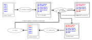

# MUPPET: An automated OpenMP mutation testing framework for performance optimization

## Overview

MUPPET is a tool for OpenMP programs that identifies program modifications
called *mutations* aimed at improving program performance. Existing performance
optimization techniques, including profiling-based and auto-tuning techniques,
fail to indicate program modifications at the source level thus preventing their
portability across compilers. MUPPET aims to help HPC developers reason about
performance defects and missed opportunities to improve performance at the
source code level. 

## How MUPPET works



First, MUPPET generates a list of OpenMP mutations, which are defined as either
a change in an existing OpenMP directive in the program that could change the
performance of the code block that the directive targets, or adding a new OpenMP
directive that introduces parallelism to existing serial code. MUPPET considers
only mutations that are not likely to change the correctness of the code block.
Next, MUPPET considers different optimization algorithms, such as delta
debugging, Bayesian optimization (BO), and decision tree optimization, to find a
subset of mutations that, when applied to the original program, causing the
highest speedup.

MUPPET is implemented with a variety of programming languages and toolsets. The
Mutation Generator and the Transformer modules are implemented via Clang
plugins. MUPPET is compatible with programs compiled with any C/C++ compiler as
long as it supports OpenMP 5.0.

The Optimizer and Tester modules, and the overarching framework managing the
communication between modules, on the other hand, are implemented in Python
3.10. The required tools are all included in the docker container provided.

## Installation, Setup, and Running Example Programs

### Prerequisites

1. Linux system. We have tested on Ubuntu 22.04, both natively and on WSL2.
2. 10 GiB free disk space recommended.
3. Docker is installed on your system, and it is verified that you can call
   `docker pull` with non-root user without using `sudo`.
4. Clone this GitHub repository to a local directory of your choice.

```
git clone https://github.com/LLNL/MUPPET [MUPPET directory]
```

### Setup Docker container with code repository

We have two options to set up the reproduction environment.

#### Option 1: pull and run Docker container from DockerHub

In the Linux terminal, execute the following commands to pull the Docker
container and run it. After entering the root user bash prompt inside the Docker
container. The shell script will detect if you already have the container. If
not, it will run it; otherwise, it simply resumes running.

```
cd [MUPPET directory]
./run_docker.sh
```

#### Option 2: build your own Docker container on local machine

Build the Docker image using the Dockerfile inside the code repository, then run
the Docker container. Please note that the RAM + swap area of your local PC must
be no less than 32GiB in order to finish building without errors. It takes
several hours to finish building the docker image.

```
cd [MUPPET directory]
docker build . -t ucdavisplse/muppet-docker:latest
./run_docker.sh
```

### Setup environment and build tools

Run the initial setup script (`setup.sh`) to install third-party software
required for MUPPET to run.

```
cd /root/muppet-docker
source setup.sh
source driver/setup_cc.sh
./build_single_plugin.sh
```

### Set CPU affinity

Set the core affinity for your OpenMP programs depending on the computer you
are running the program on. Check `thirdparty/faros/faros-config.py`:

(1) set the number of threads you want your OpenMP program to run with. \
(2) set the core indices you want your OpenMP program to run with.

For example, during our experimental evaluations, we use a dual CPU Intel
E5-2695 v3 with 14 x 2 = 28 cores in total, with SMT disabled so there are in total
28 visible cores to the OS. Thus we set the number of threads to be
14, and use up all cores in CPU1 (indices 14-27).

```
if args.numthreads:
    numthreads = args.numthreads
else:
    numthreads = 14 # (1)
run_cmd = "taskset -c 14-27 env OMP_NUM_THREADS=" + str(numthreads) # (2)
```

### Run an individual experiment

Run the following command in the code repository directory:

```
python3 driver/mutate_[opt].py -p [program] -r [times] -m
```

`[opt]` can be either `bo`, `dd` or `fo` (Bayesian Optimization, delta
debugging, decision tree optimization), as described in [[1]](#1).

`[program]` can be any one from the following list:

```
matmul
b+tree
backprop
BT
cfd
CG
cloudsc
CoMD
CoSP2
EP
FT
heartwall
hotspot
hotspot3D
hpcg
kmeans
lavaMD
leukocyte
LU
lud
LULESH
MG
myocyte
nn
nw
particlefilter
pathfinder
SP
srad
streamcluster
```

`-r [times]` means running each program variant `[times]` to gather running
time. `-r 3` means running each 3 times.

`-m` means using the minimum time as fitness function output for algorithms.
Disabling it will use the average/mean.

Once experiment is finished, run the following command to cleanup:

```
python3 driver/mutate_[opt].py -p [program] -c
```

Log files and transformed program source code are stored in the `logs`
directory. 

The general results of each run, including run time, speedup, experiment time
consumed, are written into `results_[opt].csv` file.

### Run all experiments

Run the following command in the code repository directory:

```
python3 run_all.py
```

Set the `method` variable in the Python script to run the experiments with
either `bo`, `dd` or `fo` (Bayesian Optimization, delta debugging, decision tree
optimization)

## References

<a id="1">[1]</a> 
[Dolores Miao, Ignacio Laguna, Giorgis Georgakoudis, Konstantinos
Parasyris, Cindy Rubio-González, An automated OpenMP mutation testing framework
for performance optimization, Parallel Computing, Volume 121, 2024, 103097, ISSN
0167-8191](muppet.bib)

## License

MUPPET is distributed under the terms of the MIT License.

See LICENSE and NOTICE for details.

LLNL-CODE-xxxxxx
